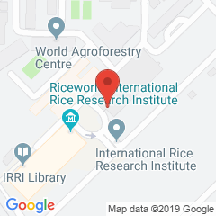
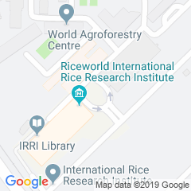

# Google Maps Static API

PHP-SDK

## Getting started

Below are the most basic examples you can play with.

### Marker example
```php
<?php
require_once('/path/to/package.php');

// Prepare the map
// See https://developers.google.com/maps/documentation/maps-static/get-api-key
$map = new Static_Map( "AIzaSequerraKeyOfSomeSortSeeDocumentation" );

// Prepare the marker
$marker = new Marker( 14.168986 , 121.255112 );

// Plot the marker to the map
$map->add_marker( $marker );

// Generate the URL
echo $map;
?>
```
**Output**

```
https://maps.googleapis.com/maps/api/staticmap?markers=14.168986,121.255112&size=240x240&key=AIzaSequerraKeyOfSomeSortSeeDocumentation
```

**Screenshot**



### Multiple markers example
```php
<?php
require_once('/path/to/package.php');

// Prepare the map
// See https://developers.google.com/maps/documentation/maps-static/get-api-key
$map = new Static_Map( "AIzaSequerraKeyOfSomeSortSeeDocumentation" );

// Prepare the markers
$west_roundabout = new Marker( 14.168986 , 121.255112 );
$east_roundabout = new Marker( 14.169831 , 121.258285 );

// Plot the markers to the map
$map->add_marker( $west_roundabout );
$map->add_marker( $east_roundabout );

// Generate the URL
echo $map;
?>
```
**Output**

```
https://maps.googleapis.com/maps/api/staticmap?markers=14.168986,121.255112&markers=14.169831,121.258285&size=240x240&key=AIzaSequerraKeyOfSomeSortSeeDocumentation
```

**Screenshot**


### Plain map example
```php
<?php
require_once('/path/to/package.php');

// Prepare the map
// See https://developers.google.com/maps/documentation/maps-static/get-api-key
$map = new Static_Map( "AIzaSequerraKeyOfSomeSortSeeDocumentation" );

// Set the location of the center of the map and the zoom level view
$map->set_center( 14.168986 , 121.255112 );
$map->set_zoom(17);

// Generate the URL
echo $map;
?>
```

**Output**

```
https://maps.googleapis.com/maps/api/staticmap?&center=14.168986,121.255112&zoom=17&size=240x240&key=AIzaSequerraKeyOfSomeSortSeeDocumentation
```

**Screenshot**



### Hybrid map example
```php
<?php
require_once('/path/to/package.php');

// Prepare the map
// See https://developers.google.com/maps/documentation/maps-static/get-api-key
$map = new Static_Map( "AIzaSequerraKeyOfSomeSortSeeDocumentation" );

// Set the location of the center of the map and the zoom level view
$map->set_center( 14.168986 , 121.255112 );
$map->set_zoom(17);

// Set the map type
$map->set_map_type('hybrid');

// Generate the URL
echo $map;
?>
```

**Output**

```
https://maps.googleapis.com/maps/api/staticmap?&center=14.168986,121.255112&zoom=17&size=240x240&maptype=hybrid&key=AIzaSequerraKeyOfSomeSortSeeDocumentation
```

**Screenshot**


