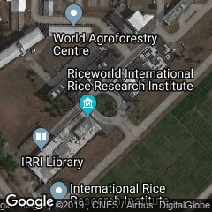

# PHP SDK for Google Maps Static API

Google's [Map Static API](https://developers.google.com/maps/documentation/maps-static/intro) is exhaustingly difficult. This PHP SDK would make things easy as simple as 1-2-3!

## Contents
1. [Getting started](#getting-started)
2. [Examples](#examples)
	* [Multiple markers](#multiple-markers)
	* [Plain map](#plain-map)
	* [Hybrid map](#hybrid-map)
3. [Installation](#installation)
4. [Reference](#reference)

## Getting started

```php
<?php
require_once('/path/to/package.php');

$map = new Static_Map( "YOUR_API_KEY" );
$marker = new Marker( 14.168986 , 121.255112 );

// Plot the marker to the map
$map->add_marker( $marker );

// Generate the URL
echo $map;
?>
```
**Output**

```
https://maps.googleapis.com/maps/api/staticmap?markers=14.168986,121.255112&size=240x240&key=YOUR_API_KEY
```

**Screenshot**


## Examples

### Multiple markers
```php
<?php
require_once('/path/to/package.php');

$map = new Static_Map( "YOUR_API_KEY" );

// Prepare the markers
$west_roundabout = new Marker( 14.168986 , 121.255112 );
$east_roundabout = new Marker( 14.169831 , 121.258285 );

// Plot the markers to the map
$map->add_marker( $west_roundabout );
$map->add_marker( $east_roundabout );

// Generate the URL
echo $map;
?>
```
**Output**

```
https://maps.googleapis.com/maps/api/staticmap?markers=14.168986,121.255112&markers=14.169831,121.258285&size=240x240&key=YOUR_API_KEY
```

**Screenshot**


### Plain map
```php
<?php
require_once('/path/to/package.php');

$map = new Static_Map( "YOUR_API_KEY" );

// Set the location of the center of the map and the zoom level view
$map->set_center( 14.168986 , 121.255112 );
$map->set_zoom(17);

// Generate the URL
echo $map;
?>
```

**Output**

```
https://maps.googleapis.com/maps/api/staticmap?&center=14.168986,121.255112&zoom=17&size=240x240&key=YOUR_API_KEY
```

**Screenshot**


### Hybrid map
```php
<?php
require_once('/path/to/package.php');

$map = new Static_Map( "YOUR_API_KEY" );

$map->set_center( 14.168986 , 121.255112 );
$map->set_zoom(17);

// Set the map type
$map->set_map_type('hybrid');

// Generate the URL
echo $map;
?>
```

**Output**

```
https://maps.googleapis.com/maps/api/staticmap?&center=14.168986,121.255112&zoom=17&size=240x240&maptype=hybrid&key=YOUR_API_KEY
```

**Screenshot**

